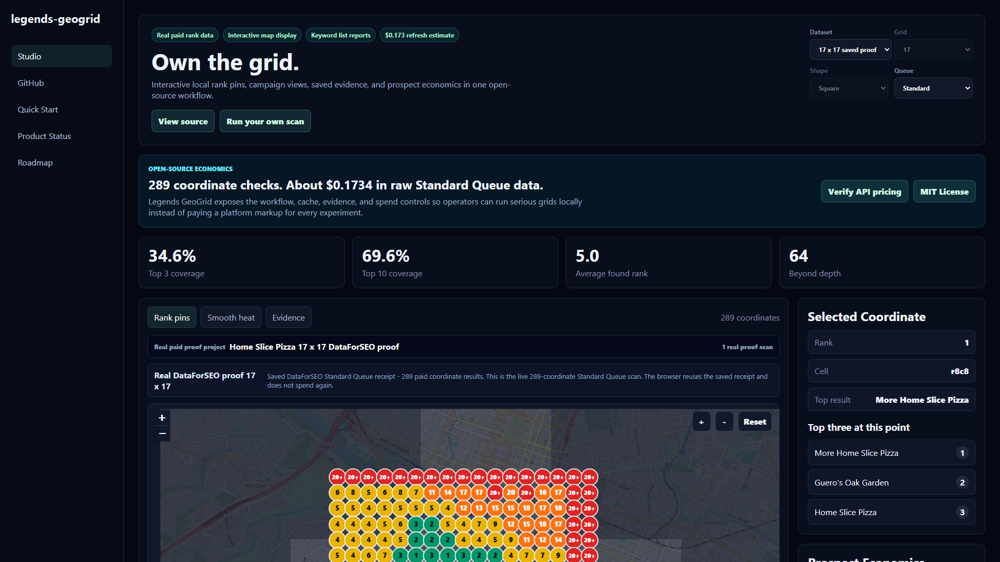

# legends-geogrid

legends-geogrid is an open-source, local-first geo-grid rank scanner for Google Maps results. It turns one business, one keyword, and a center coordinate into a visual ranking grid without requiring a hosted rank-tracking subscription.



The browser studio ships with a saved real-world 17 x 17 proof scan, so you can explore the interface without credentials or API spend. The Python runners use DataForSEO for fresh scans, cache results by scan fingerprint, and require explicit execution plus a cost ceiling before spending credits.

## Why it exists

A 17 x 17 grid contains 289 coordinate checks. At DataForSEO's documented September 2026 Standard Queue base rate of `$0.0006` per Maps SERP, one 17 x 17 business-keyword scan is about `$0.1734` in raw rank-data cost. One thousand equivalent scans are about `$173.40` before any optional parameter multipliers.

That is the point of this project: the underlying data collection can be inexpensive when you own the workflow. legends-geogrid gives builders, agencies, and local SEO operators a transparent starting point instead of forcing every experiment through a SaaS credit system.

Pricing changes. Depth above 100 results and other paid parameters can multiply the actual charge. The runners include the documented depth multiplier in estimates, but always review current DataForSEO pricing before a large run.

## What works

- Interactive Leaflet/OpenStreetMap studio with rank pins, heat view, evidence view, and cost planning.
- Saved 17 x 17 and 5 x 5 proof datasets that do not trigger API calls.
- Single-business DataForSEO Google Maps SERP runner.
- CSV-driven bulk runner with estimates, fingerprints, freshness-aware caching, and resumable artifacts.
- Standard, Priority, and Live DataForSEO methods.
- Explicit `--execute` and `--confirm-cost-usd` spend gates.
- Markdown, HTML, JSON, JSONL, and CSV artifacts.
- No database, hosted backend, analytics, or telemetry.

This is a practical local tool and reference implementation, not feature-for-feature parity with a mature hosted platform.

## Quick start: browser demo

Requirements:

- Node.js 20.19+ or 22.12+
- pnpm 10+
- Python 3.10+ for scan runners

```powershell
git clone https://github.com/avalonreset/legends-geogrid.git
cd legends-geogrid
pnpm install --frozen-lockfile
pnpm dev
```

Open the local URL printed by Vite. No DataForSEO credentials are needed for the saved proof or modeled demo.

Run the full local verification:

```powershell
pnpm check
```

## Estimate a fresh scan

Estimation is the default. This command makes no API call and spends nothing:

```powershell
python tools/local_heatmap_poc.py `
  --keyword "pizza" `
  --target-name "Example Pizza" `
  --center-lat 30.249711 `
  --center-lng -97.749132 `
  --grid-size 17 `
  --radius-km 2 `
  --depth 20 `
  --method standard
```

## Run a paid scan

Set credentials in your shell. Do not put them in Git:

```powershell
$env:DATAFORSEO_USERNAME="your-login"
$env:DATAFORSEO_PASSWORD="your-password"
```

Then repeat the estimate command with both spend gates:

```powershell
python tools/local_heatmap_poc.py `
  --keyword "pizza" `
  --target-name "Example Pizza" `
  --center-lat 30.249711 `
  --center-lng -97.749132 `
  --grid-size 17 `
  --radius-km 2 `
  --depth 20 `
  --method standard `
  --execute `
  --confirm-cost-usd 0.18
```

The command refuses to execute when its estimated base cost exceeds the ceiling.

For stronger business matching, add a known `--target-cid`, `--target-place-id`, or `--target-domain`. Name matching alone is intentionally conservative but can still produce false positives for similar business names.

## Bulk scans

Start with the bundled no-credit dry run:

```powershell
pnpm dryrun:sample
```

Estimate your own CSV:

```powershell
python tools/bulk_geogrid_runner.py `
  --prospects prospects.csv `
  --run-id dentists-austin `
  --method standard `
  --grid-size 5 `
  --radius-km 2 `
  --depth 20
```

Execute only after reviewing the manifest and total ceiling:

```powershell
python tools/bulk_geogrid_runner.py `
  --prospects prospects.csv `
  --run-id dentists-austin `
  --method standard `
  --grid-size 5 `
  --radius-km 2 `
  --depth 20 `
  --execute `
  --confirm-cost-usd 15
```

The sample CSV documents accepted columns. By default, artifacts stay under the repository's ignored `bulk-runs/` directory. To write an optional Obsidian-style summary elsewhere, pass `--vault-data-dir <directory>` explicitly.

## Cache identity

Paid scans are fingerprinted by target identity, keyword, center coordinate, radius, grid size, depth, zoom, device, language, search domain, search-places setting, and queue method. Fresh cached scans are skipped before paid calls.

Cache protection reduces accidental duplicate work; it is not a transactional billing guarantee. DataForSEO does not refund duplicate tasks caused by client-side mistakes, so keep the spend ceiling conservative.

## Repository map

- `src/` — local Vite studio and saved parsed proof datasets.
- `tools/local_heatmap_poc.py` — estimate-first single scan runner.
- `tools/bulk_geogrid_runner.py` — cache-aware CSV runner.
- `tools/geogrid_doctor.py` — local readiness check.
- `tests/` — cost, grid, cache, and no-spend safety tests.
- `examples/` — sample CSV and sanitized proof artifacts.
- `docs/` — product status, technical notes, roadmap, and demo screenshot.
- `THIRD_PARTY_NOTICES.md` — software licences, service/data terms, and attribution details.

## Data and privacy

Fresh run folders can contain business names, coordinates, public Maps listing details, DataForSEO task IDs, and raw API responses. They are ignored by Git by default. Review artifacts before sharing them and follow the terms and legal rights that apply to your DataForSEO account and the underlying search-engine data.

The bundled Home Slice Pizza proof is historical demonstration data collected on June 26, 2026. It contains only the target name, keyword, general location, scan coordinates, ranks, and public business titles needed for the demo. It contains no credentials, account identifiers, task IDs, raw provider payloads, contact details, or private client data. It is not a current ranking claim or an endorsement.

## Attribution and provenance

- [Leaflet](https://github.com/Leaflet/Leaflet) provides the interactive map library under the BSD 2-Clause License.
- [OpenStreetMap](https://www.openstreetmap.org/copyright) contributors ([GitHub](https://github.com/openstreetmap)) provide the default map data under the ODbL. The app uses the official browser tile endpoint for normal interactive viewing, preserves visible linked attribution, and does not implement tile prefetching or offline download. Public or high-traffic deployments should review the [tile usage policy](https://operations.osmfoundation.org/policies/tiles/) and configure an appropriate provider when necessary.
- [DataForSEO](https://dataforseo.com/apis/serp-api/google-maps-api) ([GitHub](https://github.com/dataforseo)) provides the optional Google Maps SERP API used for fresh scans. Users bring their own account and must follow the current [DataForSEO Terms of Service](https://dataforseo.com/terms-of-service) and applicable search-provider terms.
- [Vite](https://github.com/vitejs/vite) and [PostCSS](https://github.com/postcss/postcss) are MIT-licensed build tools. Production builds generate `dist/third-party-licenses.md` from the exact bundled dependency graph.

The original product research compared public workflow and pricing information from [Local Falcon](https://www.localfalcon.com/) ([GitHub](https://github.com/local-falcon)), [Search Atlas](https://searchatlas.com/local-seo-software/) ([GitHub](https://github.com/search-atlas-group)), [LeadSnap](https://leadsnap.com/features/local-citations/), and [BrightLocal](https://www.brightlocal.com/citation-builder/) ([GitHub](https://github.com/BrightLocal)). They were market references only: the current release does not contain their source code, assets, screenshots, or proprietary data. See [Provenance and research sources](docs/PROVENANCE.md) and [Third-party notices](THIRD_PARTY_NOTICES.md).

## License

legends-geogrid is MIT licensed. See [LICENSE](LICENSE). Third-party components, services, trademarks, and data remain subject to their own licences and terms; see [THIRD_PARTY_NOTICES.md](THIRD_PARTY_NOTICES.md).

legends-geogrid is independent software. It is not affiliated with or endorsed by DataForSEO, Google, OpenStreetMap, Leaflet, Local Falcon, Search Atlas, LeadSnap, or BrightLocal.
