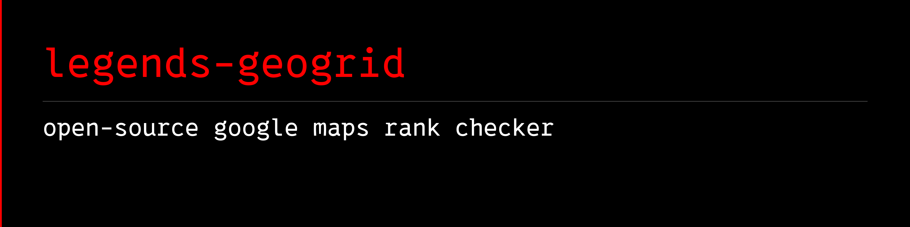

<a name="banner"></a>
<a name="legends-geogrid"></a>

# 

[](https://github.com/avalonreset/legends-geogrid/releases/latest)
[](https://github.com/avalonreset/legends-geogrid/actions/workflows/ci.yml)
[](LICENSE)

legends-geogrid is an **open-source google maps rank checker** for local SEO. See where a business ranks across a geographic grid, compare visibility across services, and turn the evidence into readable PDF reports. Run it locally with your own DataForSEO account, without a rank-tracking subscription.

Explore a saved real-world 17 × 17 pizza-shop scan in the browser, or generate a sample strategy report without credentials or API spend. Fresh scans use [legends-dataforseo-kit](https://github.com/avalonreset/legends-dataforseo-kit), with explicit execution, cost estimates, and reusable cached results.

<p align="left">
  <a href="https://www.youtube.com/shorts/4RYY_gh6b70">
    
  </a>
</p>
<p align="left">
  <a href="https://www.youtube.com/shorts/4RYY_gh6b70"><em>why have we never met before?</em></a>
</p>

## What 0.4.0 adds

A ranking grid should help answer a decision: where does a business appear, which services are weaker, and what should be investigated or changed next? Version 0.4.0 connects business research, justified search themes, comparable measurements, readable recommendations, and a persistent study library.

| Improvement | What it gives you |
| --- | --- |
| Research and study library | Website/public-profile evidence, 3-5 justified themes, proposals and hashed Markdown/JSON study history. |
| Enhance a saved study | Estimate and execute finer sampling within the same area, reusing eligible observations; outward expansion remains a separate recommendation. |
| Multi-query PDF and HTML reports | Compare services using one shared study, with supplied hypotheses and actions kept separate from measured findings. |
| Map-first layout and copy-fit checks | Large maps, consistent margins, compact legends, neutral distance bands, and readable service commentary. Report copy excludes em dashes. |
| Adaptive exploration | Expand in directions that need more evidence, with explicit stopping rules and unresolved boundaries. |
| Evidence and missing-data checks | Distinguish observed absence from short lists, empty responses, errors, and unmeasured points. |
| Discovery-first study recipe | Establish identity, geography, relevant queries, and the decision before buying hundreds of measurements. |

The software calculates and renders evidence. The operator supplies business context, evaluates hypotheses, and writes supported recommendations. It does not automatically choose profitable territories or diagnose a Google penalty.

**Business-only request?** Give your agent the [study recipe](SKILL.md). It researches the website, public Google Business Profile and DataForSEO evidence, then recommends [3-5 distinct search themes](docs/QUERY_SELECTION_POLICY.md). A narrower study needs an evidence-backed explanation. The [study command](docs/STUDY_CONTRACT.md) validates that evidence before collection.

**Start here:** [Study recipe](docs/START_A_STUDY.md) · [Report configuration](examples/reports/README.md) · [Adaptive collection](examples/adaptive/README.md) · [Latest release](https://github.com/avalonreset/legends-geogrid/releases/latest)

## Try a report first

**Want more detail after a study?** Tell your agent **enhance**. It assesses the
saved results, estimates incremental collection, reuses eligible observations,
and produces a new HTML/PDF edition within the approved budget. Original reports
and evidence stay banked. See [enhance a study](docs/ENHANCE.md).

Download and extract the source ZIP, or clone this repository. From its `legends-geogrid` folder, use Python 3.10+:

```sh
python -m pip install -r requirements-report.txt
python tools/strategy_report.py --config examples/reports/urban-dentist.json --output-dir runs/first-report --proof --require-pdf-qa
```

Open `runs/first-report/report.pdf`. This synthetic example makes no network requests and needs no API credentials. Use a fresh output directory when repeating it; existing reports are protected against overwrites. Outputs also include HTML, map images, normalized evidence, and QA results.

**Real reports default to free street maps**, using OpenFreeMap and OpenStreetMap data. No Google API key is required. Install the map renderer once:

```sh
python -m pip install -r requirements-basemaps.txt
python -m playwright install --with-deps chromium
python tools/geogrid_doctor.py --reports --basemaps
```

Internet access is required when acquiring maps. If imagery cannot load, report generation stops with setup guidance instead of silently substituting a bare grid. Synthetic examples remain offline coordinate diagrams. For optional Google Maps imagery, supplied maps, and troubleshooting, see [street-map setup](docs/BASEMAPS.md).

## A local rank tracker at data cost

If you are evaluating a Local Falcon alternative, start with the tradeoff: you own the workflow and local outputs, and take responsibility for setup, scheduling, and interpretation. This is a self-managed tool rather than a managed-service feature match. Fresh searches use your DataForSEO account. The single and bulk runners estimate Standard Queue scans at a modeled base of `$0.0006` per task: 289 tasks in a 17 x 17 scan total `$0.1734` before optional multipliers. Adaptive collection uses the Live endpoint and its different rate. These are software estimates, not a live price quotation or a provider-enforced billing cap.

Review the generated estimate and [current provider pricing](https://dataforseo.com/apis/serp-api/google-maps-api) before paid execution. Both an execution flag and a cost ceiling are required. The offline examples and replay mode spend nothing.

## What works

- Interactive Leaflet/OpenStreetMap studio with rank pins, heat view, evidence view, and cost planning (visualizes bundled demonstration datasets; arbitrary run import is on the roadmap).
- Saved 17 x 17 and 5 x 5 proof datasets that do not trigger API calls.
- Strategy report engine (`tools/strategy_report.py`) producing screen-reading Letter PDFs and HTML from normalized multi-lane observations under a strict map-first copy-fit contract.
- Adaptive sampling collector (`tools/adaptive_geogrid.py`) supporting sector-based expansion, offline planning, and synthetic replay.
- Single-business DataForSEO google maps SERP runner.
- CSV-driven bulk runner with estimates, fingerprints, freshness-aware caching, and resumable artifacts.
- Standard, Priority, and Live DataForSEO methods.
- Explicit `--execute` and `--confirm-cost-usd` spend gates.
- Evidence-gate pin verifier (`tools/verify_pins.py`) tracing every rendered pin to raw JSON.
- Markdown, HTML, JSON, JSONL, and CSV artifacts.
- No database, hosted backend, analytics, or telemetry.

This is a practical local tool and reference implementation, not feature-for-feature parity with a mature hosted platform.

## Explore the browser demo

Requirements:

- Node.js 20.19+ or 22.12+
- pnpm 10+
- Python 3.10+ for scan runners

```powershell
git clone https://github.com/avalonreset/legends-geogrid.git
cd legends-geogrid
pnpm install --frozen-lockfile
pnpm dev
```

Open the local URL printed by Vite. No DataForSEO credentials are needed for the saved proof or modeled demo.

Run the full local verification after installing the report dependencies:

```powershell
python -m pip install -r requirements-report.txt
pnpm check
```

## Estimate a fresh scan

Estimation is the default. This command makes no API call and spends nothing:

```powershell
python tools/local_heatmap_poc.py `
  --keyword "pizza" `
  --target-name "Example Pizza" `
  --center-lat 30.249711 `
  --center-lng -97.749132 `
  --grid-size 17 `
  --radius-km 2 `
  --depth 20 `
  --method standard
```

## Install the shared DataForSEO engine

Fresh scans depend on [legends-dataforseo-kit](https://github.com/avalonreset/legends-dataforseo-kit), an open-source Python API client and CLI. It handles provider access without an MCP server. GeoGrid handles the grid, evidence, caching, and reports.

Reports default to the dark theme. For pure-white printable reports, set `"theme": "light"` in the report config; both themes preserve rank colors and legends-geogrid branding.

**Tested pairing:** legends-geogrid v0.4.0 with legends-dataforseo-kit v0.4.0.
The requirement below pins the kit's immutable public source ZIP, so installation
does not require Git. The two projects are maintained and versioned separately.
Offline reports remain usable without the provider dependency or credentials.

```sh
python -m pip install -r requirements-dataforseo.txt
python tools/geogrid_doctor.py --dataforseo
```

The kit is required for fresh scans; saved demos, cost estimates, replay, and offline reports work without it. An agent setting up live scans should install this dependency before execution. See [agent instructions](AGENTS.md).

## Run a paid scan

Set credentials in your shell. Do not put them in Git:

```powershell
$env:DATAFORSEO_LOGIN="your-login"
$env:DATAFORSEO_PASSWORD="your-password"
```

Then repeat the estimate command with both spend gates:

```powershell
python tools/local_heatmap_poc.py `
  --keyword "pizza" `
  --target-name "Example Pizza" `
  --center-lat 30.249711 `
  --center-lng -97.749132 `
  --grid-size 17 `
  --radius-km 2 `
  --depth 20 `
  --method standard `
  --diagnostic --execute `
  --confirm-cost-usd 0.18
```

The command refuses to execute when its estimated base cost exceeds the ceiling.

For reliable business matching, anchor identity with `--target-cid`, `--target-place-id`, or `--target-domain`. Domain matching uses canonical hostname boundaries (ignoring protocol and leading `www.`). When specific identifiers are provided, every supplied identifier must match; the runner never falls back to loose name matching or unmatched domains. Ambiguous name matching is rejected. Use `--zoom 3` through
`--zoom 21` and explicitly choose `--search-this-area` (default true, preserving
the previous provider default) or `--no-search-this-area`. Zoom changes the search
viewport independently of grid spacing. Calibrate a few representative points
before expanding a scan: a short viewport result list is not proof of rank 20+.

## Bulk scans

Start with the bundled no-credit dry run:

```powershell
pnpm dryrun:sample
```

Estimate your own CSV:

```powershell
python tools/bulk_geogrid_runner.py `
  --prospects prospects.csv `
  --run-id dentists-austin `
  --method standard `
  --grid-size 5 `
  --radius-km 2 `
  --depth 20
```

Execute only after reviewing the manifest and total ceiling:

```powershell
python tools/bulk_geogrid_runner.py `
  --prospects prospects.csv `
  --run-id dentists-austin `
  --method standard `
  --grid-size 5 `
  --radius-km 2 `
  --depth 20 `
  --diagnostic --execute `
  --confirm-cost-usd 15
```

The sample CSV documents accepted columns. By default, artifacts stay under the repository's ignored `bulk-runs/` directory. To write an optional Obsidian-style summary elsewhere, pass `--vault-data-dir <directory>` explicitly.

Optional CSV columns `search_this_area`, `search_places`, `match_threshold`, and
`top_competitors` override CLI defaults per scan. Boolean cells accept true/false;
an explicit false is preserved. Both runners record the full measurement settings.

## Strategy reports and adaptive sampling

The report layer turns normalized observations and operator-written analysis into a multi-query client PDF under a strict [map-first policy](docs/keyword-formula.md#map-first-report-policy-and-qa-contract):

1. **Entity resolution and falsifiable thesis:** Anchor target identity with exact google maps CID, Place ID, or canonical domain (matching hostname boundaries without protocol or `www`). Verify the operating base when available, or explicitly label an agreed market reference; never infer a headquarters from an advertised city. Confirm exact IDs through diagnostic lookups; loose name matching is rejected as ambiguous. Formulate a falsifiable thesis (e.g., core vs. corridor visibility) before spending; the thesis is always treated as a user hypothesis, never a guaranteed outcome.
2. **Complementary query intent:** Pair category controls with consumer repair or service queries. Annotate query ambiguity rather than disqualifying queries or renumbering ranks.
3. **Separate search surfaces:** Keep google maps ranks (`rank_group`), Google Search local-pack items, and organic website rankings separate. A Maps rank is not website traffic or a penalty diagnosis.
4. **Adaptive sampling:** When testing geographic reach, `tools/adaptive_geogrid.py` supports sector-based exploration (`adaptive8sectors`) around a complete base panel. Two clean-negative layers at negative depth require a farther sentinel. Stops are bounded `sampled_stop` states, not geographic absence certificates.
5. **Map-first copy-fit contract:** Combine short service summaries on a single page within a unified 516 pt content column and 48 pt Letter margins (`PAGE_W=612, PAGE_H=792, MARGIN=48, COLUMN=516, MAP_W=516, MAP_H=410`). A compact native text legend band and measured vertical flow keep service findings together with their maps. Continuation pages are used only when extensive tabular diagnostics or narrative genuinely exceed a single page, avoiding arbitrary forced splits.
6. **Inconclusive vs. absence:** Ranks distinguish five explicit states: `found`, `not_returned`, `error`, `empty`, and `unmeasured`. Short or empty lists do not prove rank 20+ or lack of demand.
7. **Ordinary PDF full-scale visual proof:** Inspect final PDFs at 100% scale in an ordinary PDF viewer to verify legibility, pin typography, and map flow. Legacy HTML reports trace every pin to raw JSON via `tools/verify_pins.py`, while new strategy report PDFs enforce automated structural and rendering validation via `--require-pdf-qa` (`report-qa.json`). A report that fails verification does not ship.

### Strategy report generator

Install the report rendering requirements:

```sh
python -m pip install -r requirements-report.txt
```

Generate a multi-lane strategy report from a configuration file:

```sh
python tools/strategy_report.py --config examples/reports/urban-dentist.json --output-dir runs/urban --proof --require-pdf-qa
```

Outputs include `report.pdf`, `report.html`, `report-model.json`, and map PNGs. Pass `--proof` to render PDF page proofs or `--require-pdf-qa` for automated validation.

Real observations use OpenFreeMap street imagery by default; synthetic examples use offline coordinate diagrams. Optional Google Maps imagery and supplied georeferenced images are supported. See [street-map setup](docs/BASEMAPS.md).

### Adaptive collector

Plan an adaptive collection offline (calculates lattice geometry and cost ceiling without network calls):

```sh
python tools/adaptive_geogrid.py --config examples/adaptive/sample.json
```

Replay synthetic responses without API spend:

```sh
python tools/adaptive_geogrid.py --config examples/adaptive/sample.json --replay examples/adaptive/replay.json --output-dir runs/replay
```

For live collection, first create a private configuration with the real identity, study center, and queries. Do not execute the synthetic sample against the provider. Both spend gates are required:

```sh
python tools/adaptive_geogrid.py --config runs/my-config.json --output-dir runs/my-acquisition --diagnostic --execute --confirm-cost-usd 5.00
```

### Offline release verification

Run the complete offline release smoke suite (three standalone report examples: urban-dentist, rural-mobile, and georeferenced-mobile: plus an 86-row collector-to-report handoff, producing four validated PDFs):

```sh
python tools/release_smoke.py
# or via pnpm:
pnpm check:reports
```

Artifacts are written to `runs/release-smoke/` (ignored by Git). CI executes `pnpm check` (which runs `doctor:reports` and `check:reports`) across the Windows and Linux matrix (Python 3.10 and 3.12) and uploads proof artifacts.

Website, public GBP and DataForSEO demand/pilot evidence are required by the
[researched-study workflow](docs/STUDY_CONTRACT.md). Supplementary historical
references remain in `third_party/claude-seo/skills/seo-dataforseo` and `seo-maps`
(MIT, AgriciDaniel); they do not replace the current agent recipe or shared kit.
Fresh provider calls require your own DataForSEO account.

## Limits to understand

- This is a CLI toolkit with a browser demo, not an end-to-end hosted service. The studio does not yet import arbitrary scan folders.
- Maps visibility, organic website visibility, traffic, and booked work are different measurements. The report does not infer one from another.
- Business discovery and market fit are operator-led procedures, not automatically enforced prerequisites.
- Reports are screen-reading PDFs. Check the supplied basemap resolution for your intended print size.
- The adaptive collector retains provider-response hashes; the bulk runner retains raw responses. Choose the evidence-retention path your study needs.

See [product status](docs/PRODUCT_STATUS.md) and [report acceptance](docs/REPORT_ACCEPTANCE.md).

## Cache identity

Paid scans are fingerprinted by exact target fields and matching policy, keyword,
center coordinate, radius, grid size, depth, zoom, device, language, search domain,
search-places and search-this-area settings, matching threshold, competitor limit,
organic Maps rank basis, and queue method. Schema-4 identities require SHA-256
verification of all artifacts (parsed JSON, raw requests, provider responses, Markdown,
HTML) and reject unverified prior caches. Fresh compatible cached scans are skipped
before paid calls.

Reports distinguish provider errors, empty responses, incomplete lists and target
absence at returned depth. Top-3/top-10 shares disclose their eligible denominators;
unknown points are not counted as negative visibility or "no market". See
[measurement semantics](docs/TECHNICAL_NOTES.md#point-states-and-denominators).
Ranks use organic Maps `rank_group`; paid item types and explicitly paid search
placements are excluded. `rank_absolute` is retained only as metadata because
ads can shift its positions.

Cache protection reduces accidental duplicate work; it is not a transactional billing guarantee. DataForSEO does not refund duplicate tasks caused by client-side mistakes, so keep the spend ceiling conservative.

## Repository map

- `src/` :  local Vite studio and saved parsed proof datasets.
- `tools/local_heatmap_poc.py` :  estimate-first single scan runner (outputs interactive street-map HTML and a reusable PDF report config; `--map-image` is accepted for compatibility but unregistered imagery is ignored).
- `tools/bulk_geogrid_runner.py` :  cache-aware CSV runner (schema 4 with SHA-256 verification and atomic run-directory allocation).
- `tools/geogrid_doctor.py` :  local readiness check.
- `tools/pollution_gate.py` :  legacy query-mix diagnostic; its rejection labels do not supersede the current study methodology.
- `tools/report_builder.py` :  multi-intent HTML report + map PNGs.
- `tools/strategy_report.py` :  multi-lane strategy report generator (PDF, HTML, metrics, and map assets).
- `tools/adaptive_geogrid.py` :  adaptive sampling planner and collector (revision v2, incompatible with v1 run dirs; stores response SHA-256 digests in ledger rather than raw responses).
- `tools/release_smoke.py` :  offline release smoke runner exercising report fixtures and collector handoff.
- `tools/verify_pins.py` :  evidence gate: every pin traced to raw JSON.
- `docs/keyword-formula.md` :  hypothesis, identity, query controls, viewport calibration, separate search-surface measurements, and map-first report policy.
- `docs/PRODUCT_STATUS.md` :  current capabilities, honest limitations, and proof records.
- `docs/TECHNICAL_NOTES.md` :  measurement contract, point states, denominators, and cost model.
- `docs/ROADMAP.md` :  delivered milestones and future directions.
- `docs/PROVENANCE.md` :  code, data, and research provenance.
- `third_party/claude-seo/` :  vendored MIT skills (DataForSEO data, Maps intel).
- `tests/` :  cost, grid, cache, hygiene, and no-spend safety tests.
- `examples/` :  sample CSV, synthetic report configs (`examples/reports/`), sample adaptive collector configs (`examples/adaptive/`), and sanitized proof artifacts.
- `requirements-report.txt` :  Python dependencies for strategy report rendering (ReportLab, Pillow, optional pypdfium2).
- `THIRD_PARTY_NOTICES.md` :  software licences, service/data terms, and attribution details.

## Data and privacy

Fresh run folders can contain business names, coordinates, public Maps listing details, DataForSEO task IDs, and raw API responses. They are ignored by Git by default. Review artifacts before sharing them and follow the terms and legal rights that apply to your DataForSEO account and the underlying search-engine data.

The bundled Home Slice Pizza proof is historical demonstration data collected on June 26, 2026. It contains only the target name, keyword, general location, scan coordinates, ranks, and public business titles needed for the demo. It contains no credentials, account identifiers, task IDs, raw provider payloads, contact details, or private client data. It is not a current ranking claim or an endorsement.

## Attribution and provenance

- [Leaflet](https://github.com/Leaflet/Leaflet) provides the interactive map library under the BSD 2-Clause License.
- [OpenStreetMap](https://www.openstreetmap.org/copyright) contributors ([GitHub](https://github.com/openstreetmap)) provide the default map data under the ODbL. The app uses the official browser tile endpoint for normal interactive viewing, preserves visible linked attribution, and does not implement tile prefetching or offline download. Public or high-traffic deployments should review the [tile usage policy](https://operations.osmfoundation.org/policies/tiles/) and configure an appropriate provider when necessary.
- [DataForSEO](https://dataforseo.com/apis/serp-api/google-maps-api) ([GitHub](https://github.com/dataforseo)) provides the optional google maps SERP API used for fresh scans. Users bring their own account and must follow the current [DataForSEO Terms of Service](https://dataforseo.com/terms-of-service) and applicable search-provider terms.
- [Vite](https://github.com/vitejs/vite) and [PostCSS](https://github.com/postcss/postcss) are MIT-licensed build tools. Production builds generate `dist/third-party-licenses.md` from the exact bundled dependency graph.
- [Claude SEO](https://github.com/AgriciDaniel/claude-seo) by Daniel Agrici ([agricidaniel.com](https://agricidaniel.com)) contributes the vendored `seo-dataforseo` and `seo-maps` skills under `third_party/claude-seo/` under the MIT License (see `third_party/claude-seo/LICENSE` and `CITATION.cff`). If you use this software, please cite it using that file's metadata.
- [ReportLab](https://www.reportlab.com/) and [Pillow](https://python-pillow.org/) are open-source Python libraries used for local vector PDF generation and image processing (`requirements-report.txt`). They are optional local dependencies, not vendored in this repository.

The original product research compared public workflow and pricing information from [Local Falcon](https://www.localfalcon.com/) ([GitHub](https://github.com/local-falcon)), [Search Atlas](https://searchatlas.com/local-seo-software/) ([GitHub](https://github.com/search-atlas-group)), [LeadSnap](https://leadsnap.com/features/local-citations/), and [BrightLocal](https://www.brightlocal.com/citation-builder/) ([GitHub](https://github.com/BrightLocal)). They were market references only: the current release does not contain their source code, assets, screenshots, or proprietary data. See [Provenance and research sources](docs/PROVENANCE.md) and [Third-party notices](THIRD_PARTY_NOTICES.md).

## License

legends-geogrid is MIT licensed. See [LICENSE](LICENSE). Third-party components, services, trademarks, and data remain subject to their own licences and terms; see [THIRD_PARTY_NOTICES.md](THIRD_PARTY_NOTICES.md).

legends-geogrid is independent software. It is not affiliated with or endorsed by DataForSEO, Google, OpenStreetMap, Leaflet, Local Falcon, Search Atlas, LeadSnap, or BrightLocal.

### Persistent study library

The researched study workflow automatically banks evidence and readable Markdown
checkpoints in an Obsidian-compatible local library. No Obsidian installation or
MCP is required. Configure an existing vault once with `python tools/study.py
library-init --vault-dir PATH`, or use the Documents default. See
[study banking, history and recovery](docs/STUDY_LIBRARY.md).
